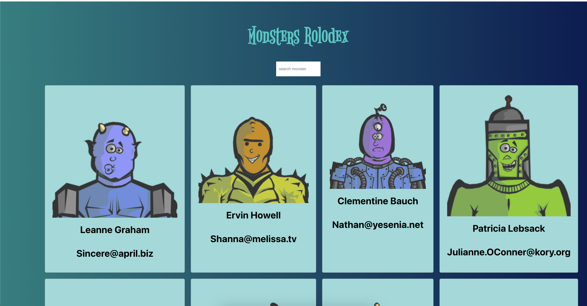

# Monster Rolodex Website

This is a simple web application built using React that displays a list of monsters fetched from an API. The app features a search functionality that allows users to filter monsters by their names. Additionally, it includes custom CSS styling for a visually appealing user experience.

## Features

- **Monster List**: Displays a list of monsters fetched from a public API.
- **Search Functionality**: Users can search for monsters by name using a search bar.
- **Responsive Design**: Custom CSS styling ensures a clean and responsive layout.

## Technologies Used

- React
- CSS
- JavaScript
- HTML
- [JSONPlaceholder API](https://jsonplaceholder.typicode.com/users)

## Demo



## How to Use

1. Clone the repository:
   ```bash
   git clone https://github.com/NishaRaju0809/monster-rolodex.git


## Available Scripts

In the project directory, you can run:

### `npm start`

Runs the app in the development mode.\
Open [http://localhost:3000](http://localhost:3000) to view it in your browser.

The page will reload when you make changes.\
You may also see any lint errors in the console.

### `npm test`

Launches the test runner in the interactive watch mode.\
See the section about [running tests](https://facebook.github.io/create-react-app/docs/running-tests) for more information.

### `npm run build`

Builds the app for production to the `build` folder.\
It correctly bundles React in production mode and optimizes the build for the best performance.

The build is minified and the filenames include the hashes.\
Your app is ready to be deployed!

See the section about [deployment](https://facebook.github.io/create-react-app/docs/deployment) for more information.

